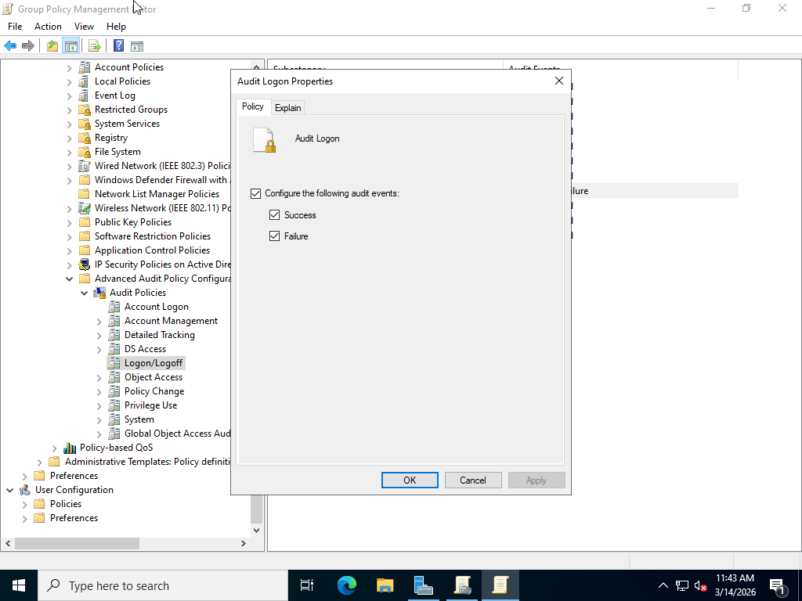
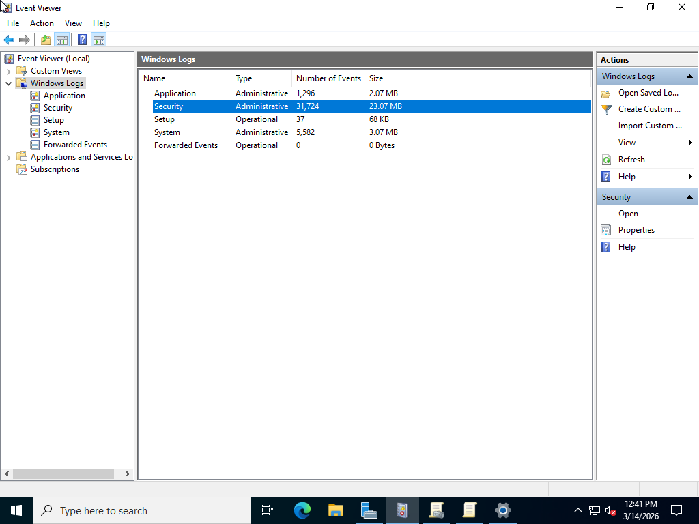
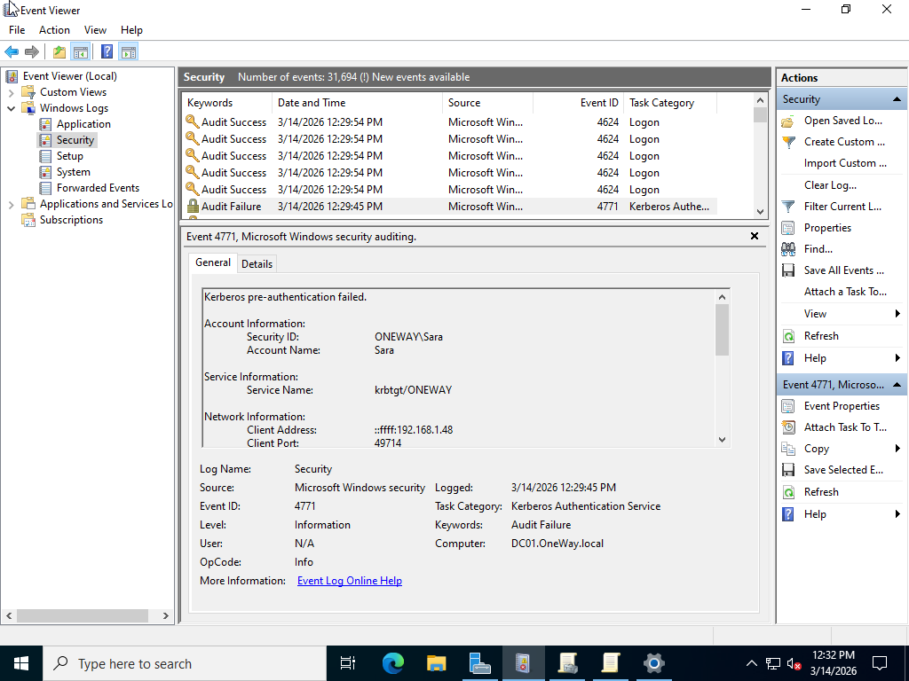
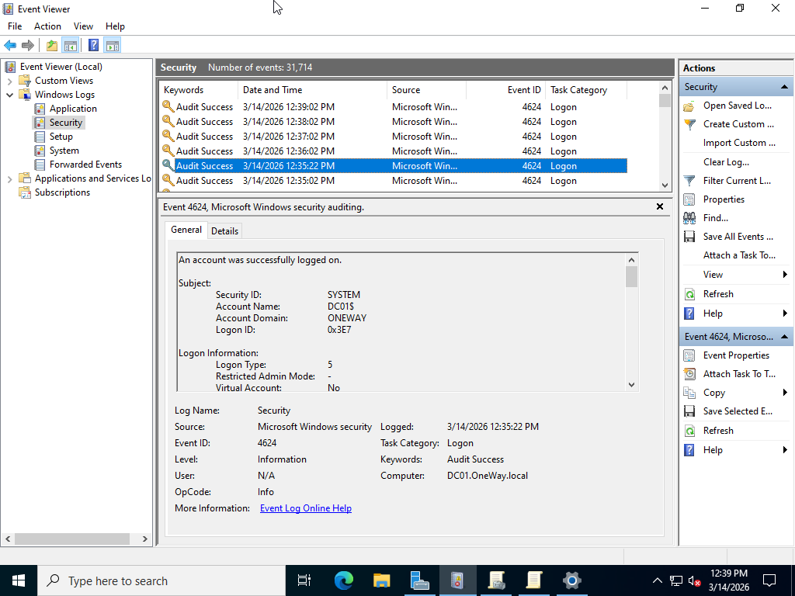

# Audit-Logon-Events
# Active Directory Logon Audit Lab

## Overview

This lab demonstrates how to monitor login activity in an Active Directory environment by enabling advanced audit policies.

The goal is to track:

- Successful logon attempts
- Failed logon attempts
- Kerberos authentication failures

These logs help administrators detect suspicious login attempts and potential brute-force attacks.

---

## Lab Environment

Domain Controller: DC01  
Domain: OneWay.local  
Client Machine: Windows 10  

Technologies Used:

- Windows Server 2022
- Active Directory
- Group Policy
- Event Viewer

---

## Configuration Steps

### 1. Enable Audit Logon Policy

Open:
Group Policy Management
Default Domain Policy → Edit

Navigate to:
Computer Configuration
Policies
Windows Settings
Security Settings
Advanced Audit Policy Configuration
Audit Policies
Logon/Logoff

Enable:
Audit Logon → Success + Failure

---

### 2. Enable Account Logon Auditing

Navigate to:

Advanced Audit Policy Configuration
Audit Policies
Account Logon

Enable:
Audit Credential Validation → Success + Failure

---

### 3. Apply Policy

Run on the client machine:
gpupdate /force

---

## Testing

1. Attempt to log in with an incorrect password.
2. Attempt to log in with the correct password.

---

## Event Monitoring

Open:
Event Viewer
Windows Logs
Security

Important Event IDs:

| Event ID | Description |
|--------|-------------|
4624 | Successful logon |
4625 | Failed logon |
4771 | Kerberos pre-authentication failed |

---

## Screenshots

### Audit Policy Enabled

### Security Log in Event Viewer

### Failed Logon Event

### Kerberos Authentication Failure

---

## Result

Logon auditing was successfully configured using Group Policy.

The domain controller now records successful and failed authentication attempts in the Security log.

This allows administrators to detect unauthorized access attempts and monitor authentication activity in the domain.
